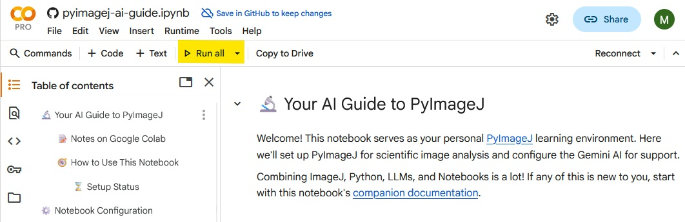
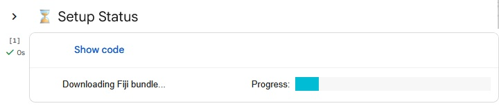
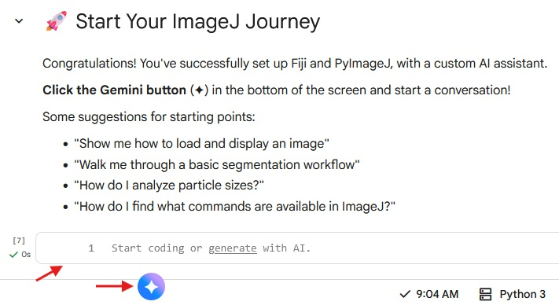
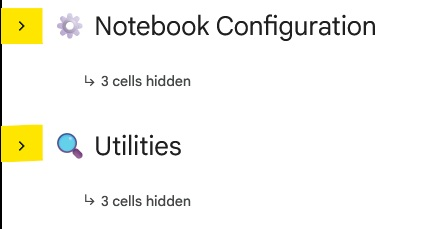
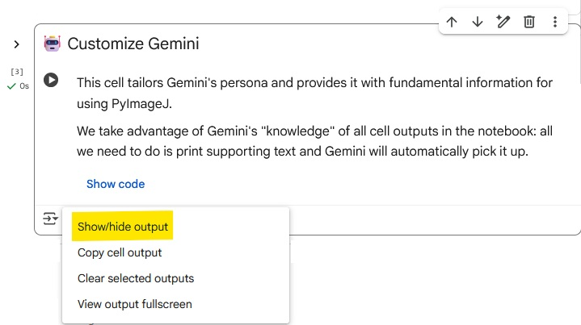
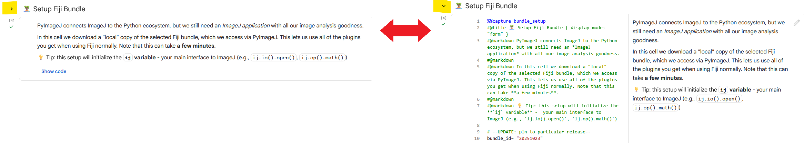
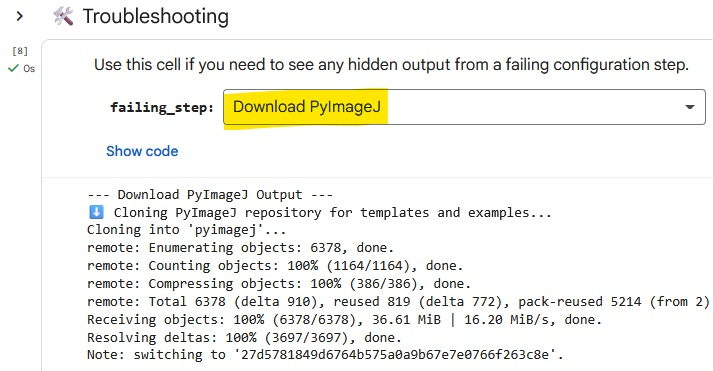
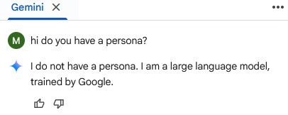
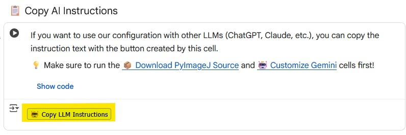

# Google Colab Notebook

This document is designed to supplement your use of our PyImageJ + Large Language Model (LLM) Google Colab Notebook:

<!-- UPDATE: pin to particular commit -->

## Background Knowledge

If any of these topics are new to you:
   * Colab → check out [our overview](Google-Colab-Basics.md)
   * LLMs → read through [prompt engineering basics](Prompt-Engineering.md)
   * Python → browse an overview, like [W3 schools](https://www.w3schools.com/python/)

## Learning Goals

For doing science, ultimately we want to code in a **reproducible** environment (*which Colab is not*). We imagine the progression of a new learner might proceed as:

- First, use our AI Notebook to experiment with PyImageJ until you are comfortable with the concepts and syntax.
- From there, you can transition to the creating Python workflows in the [Fiji Script Editor](https://imagej.net/scripting/script-editor).
- Alternatively, you *can* run Jupyter Notebooks locally. If this interests you, look at tools like [uv](https://docs.astral.sh/uv/) to [set up](Install.md) PyImageJ environments.
- If you find that you love programming, you could also explore the [developer ecosystem](https://imagej.net/develop/)! Tools like GitHub Copilot, Claude Code and cursor bring exceptional new directions to ImageJ plugin development.

💡**Tip**: LLMs can provide guidance in all of these tasks! But so can humans - please reach out on the [Image.sc forum](https://forum.image.sc/) if you need support!

Also note that if you enjoy Gemini and Colab, you can certainly use the environment to *create* Python code that will run in the Script Editor (for example). Requirements and syntax may change a bit between environments though, so typically it is easiest to develop code in the environment where it will run.

Fundamentally, **the goal of this Notebook** is to support you in building the skills and confidence that you can adapt to any of these environments, based on your own analysis needs. 

## Navigating the Notebook

### Initialization

All that's needed to start up the notebook is to click the `Run All` button in the toolbar:

This will do several things, which unfortunately can take a few minutes. You'll see a progress bar with status indicators as the set up functions are running:

Here's an overview of key steps:

* **Downloading PyImageJ source** from the [GitHub repository](https://github.com/imagej/pyimagej) is necessary because it contains the [rules and persona files](https://github.com/imagej/pyimagej/tree/main/doc/llms) to teach Gemini.
* **Customizing Gemini** this way allows the notebook to grow over time: we can revise these support files to bring new behavior to Gemini.
* **Downloading a Fiji bundle** provides PyImageJ access to all the plugins in a base Fiji download. 
* **Initializing PyImageJ** starts up a running instance of Fiji, which you can then access through the `ij` variable.
* ⚠️**Warning:** The only verified method of [initialization](Initialization.md) in Google Colab are using local bundles from [fiji-builds](https://github.com/fiji/fiji-builds/releases) ⚠️

Once the progress bar status shows `✅ Setup complete!`, your notebook is ready to go! You can start coding, or tell Gemini what you'd like to learn.

### Making space

The AI Notebook is big. We've tried to keep it concise, but for example the `🤖 Customize Gemini` step **must** print all of its output text (which is a lot!) so that Gemini can actually read it.

However, if you want to make things cleaner, you *can* collapse the `⚙️ Notebook Configuration` and/or `🔍 Utilities` section(s):

Additionally, you can safely hide the output of individual cells using the `Output actions` button (which appears after running code cells):

### Modifying the Notebook Itself

In this notebook we make extensive use of [Colab's forms](https://colab.research.google.com/notebooks/forms.ipynb), in large part to keep the code hidden.

If you want to dig into the internals of the notebook itself, any cell with a `Show code` button at the bottom can be toggled with the `>` at the top-left of that cell:

The following cells have # --UPDATE comments marking areas with simple edits to influence Notebook reproducibility:

* `📦 Download PyImageJ Source`: specify [the commit](https://github.com/imagej/pyimagej) for the LLM instruction files.
* `🏝️ Setup Fiji Bundle`: specify [the bundle ID](https://github.com/fiji/fiji-builds/releases) for the Fiji download.

## Troubleshooting

### Failures during setup

The setup generates *a lot* of output, which we hide by default to avoid overwhelming new users and cluttering the notebook.

If something goes wrong, the `⚙️ Utilities` section has tools to help.

First, you can check the `✅ Verify Setup` step to see if there are PyImageJ problems.

If you need more information, you can use the `🛠️ Troubleshooting` cell to view a step's hidden output:

### Gemini didn't pick up the personality text

If you start communicating with Gemini *before loading* the the instructional + personality text, Gemini may not see it properly.

The easiest thing to do is reload the page and re-run the notebook.

## FAQ

### Why a Colab Notebook?

This came from a desire to build image analysis workflows using ImageJ in an environment where a LLM assistant has direct contextual access.

Although a first-party LLM assistant in Fiji itself would be ideal, that requires significantly more development and maintenance time.

With Colab + PyImageJ we take advantage of existing tools, and have the added benefit of access to the Python scientific software stack (e.g. [Cellpose](https://www.cellpose.org/)).

### But this notebook looks complicated!

Setting up PyImageJ previously required understanding of developer-focused tools. This notebook removes any configuration and installation barriers, allowing you to get right into image analysis.

There were also some tricky setup challenges due to the fact that notebooks are running on Google's remote computers, and not your local system. Luckily, we've already solved them for you!

Because of the general scope of this notebook, there is a lot of explanatory text. If something is still confusing or overwhelming or just not useful, that is important for us to know! Please [get in touch](https://forum.image.sc/tag/pyimagej) and let us know what we can do better.

### Are there any other reasons to use this notebook?

We are developing instruction sets for LLMs to help them produce better code. Ideally these should be tailored to the environment where the code will be running (e.g. in a notebook, or the Fiji script editor). These are targeted rules that general LLMs wouldn't have access to.

Using the AI Notebook gives you access to these instruction sets. We are also relying on users like you to provide feedback when things go wrong! That is the only way for these rulesets to grow.

### How do I use these instructions with other LLMs?

After running the notebook, there is a `📋 Copy AI Instructions` cell in the `⚙️ Utilities` section. Just click that button! Then you can paste the instructions at the start of a conversation with any other LLM.

### I thought an "AI Notebook" would use more... AI

While AI-based analysis techniques are very exciting, they are massively overpowered for most image analysis needs.

The goal of using an integrated "AI assistant" is precisely to **find** the appropriate technique for your needs. Maybe that will require another AI tool, but often it won't!

### Aren't Colab notebooks "headless"?

Technically yes - as they are running on remote (not local) computers, we don't have access to a display/monitor (and are thus "headless").

This is relevant because many ImageJ 1.x plugins were developed with an implicit assumption of an active display.

However, the AI notebook is set up to "fake" a display: this allows many ImageJ 1.x functions to work correctly, when they otherwise would have failed. (you may still run into some things that simply can't work, though)

Note that this requirement was specifically decoupled from ImageJ2 plugins, which should work as intended.