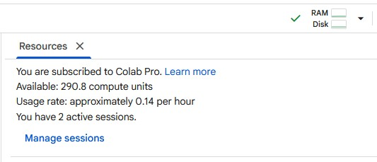
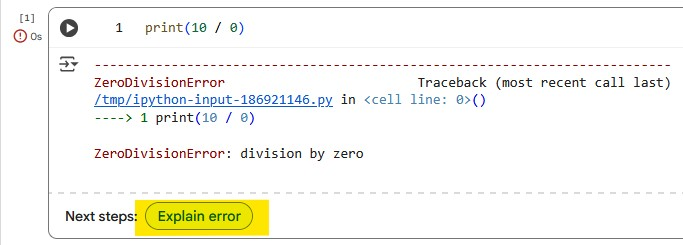

# Introduction to Google Colab

Welcome! This document is intended to guide you through the basic operations of [Google Colaboratory](https://colab.research.google.com/). The goal is to prepare you with the necessary background for using our PyImageJ [AI Tutorial Notebook](AI-Tutorial-Notebook.md).

## Disclaimer

Colab is fundamentally a non-reproducible environment:
- We do not have control over what is installed in the base environment
- We cannot even control the Python version that is installed
- The interface itself is subject to regular change. Please [let us know](https://forum.image.sc/tag/pyimagej) if screenshots or instructions are out of date!
- ❗We **strongly recommend against** publishing workflows that **must** run in Colab❗

However, Colab is a fantastic environment for learning:
- Share workflows online as files on Google Drive or GitHub
- No local software installation required
- Built-in Gemini AI assistant

And you can use it as a tool to create reproducible workflows *for other environments*.

## Getting started

Colab notebooks are accessible through [colab.research.google.com/](https://colab.research.google.com/). You will need to authenticate with a Google account. Note that Pro services may be available for [students and educators](https://colab.research.google.com/signup), but this varies by locale. The subscription plans affect the actual **runtime hardware** and plans beyond the basic (free) tier should only be required for GPU/TPU projects.

### Interface Overview


Take a moment to familiarize yourself with the essential areas of the Colab UI:
1. **Current notebook cells**. You'll edit and run your code here.
2. **App menu**. Central location for actions that are also distributed through the interface. Some aspects may change contextually, e.g. based on the ownership of the current notebook.
3. **Command toolbar**. Searchable shortcuts if you can't remember where a particular command is.
4. **Runtime status and management**. This is the *remote* computer that is running your notebook.
5. **Contextual sidebar**. The table of contents is useful for notebook navigation. Also used for connecting and browsing external files.
6. **Exploration buttons**. `Variables` will show the current Python session state. `Terminal` will open an active command prompt *in your remote runtime*.
7. **Gemini button**. This opens the Gemini chatbot and is your main window to LLM features.

### Opening Notebooks

You may notice the landing notebook change after registration. The basic [Welcome to Colab](https://colab.research.google.com/notebooks/intro.ipynb) is broad and geared towards advanced use-cases.

`File → Open notebook` brings up an comprehensive dialog to get started.


There are two categories we want to highlight:
* `Examples` includes targeted notebooks pre-built by Google
* `Google Drive` are *your personal* notebooks. When you use `File → Save a copy in Drive`, that notebook will be added to a special [Colab Notebooks](https://drive.google.com/drive/u/0/search?q=title:%22Colab%20Notebooks%22) folder in your Drive. **NOTE:** this will also include *deleted notebooks in your trash*.

### Making Notebooks Your Own

When running notebooks not authored by Google, and not owned by you, you will see a warning:


You can certainly select **Run anyway** and continue. However, as the goal of Notebooks is often to customize them for your own use, a common first step is to `File → Save a copy in Drive`. This will create a copy in your dedicated [Colab Notebooks](https://drive.google.com/drive/u/0/search?q=title:%22Colab%20Notebooks%22) folder.

## Basic Jupyter Notebook Use

Google Colab is built on [Jupyter Notebooks](https://jupyter.org/). Notebooks are documents made up of a sequence of **cells**. These cells come in two types: **Text** and **Code**. **Text** cells are primarily for documentation, while **Code** cells contain bits of Python code that run on a remote computer (not your local system).

Notebooks allow you to share Python programs that can run in (somewhat) controlled environments, independent of the user's operating system or local setup. This type of reproducibility is excellent for scientific purposes, and also for less technical users as it removes many of the setup considerations.

If you are completely new to Jupyter Notebooks, the [Overview of Colaboratory Features](https://colab.research.google.com/notebooks/basic_features_overview.ipynb) Example notebook is one of the simplest places to start.

### A Note on Python

Fundamentally, when we are using Notebooks we are using Python programs and writing Python code. Large Language Models are quite good at writing code, but a basic understanding of Python and programming concepts will be helpful in assessing, modifying and troubleshooting your work.

If you are new to Python, online introductions such as through [W3 Schools](https://www.w3schools.com/python/) or [learnpython.org](https://learnpython.org/) may be helpful. 

### Basic Cell Use

There are many ways to create cells through the menu and tool bar.  You can also place your mouse between two cells to bring up a cell creation menu:


One way to run **Code** cells is by clicking the play button in the top left corner. This run your code in your notebook's Python environment. After running, the cell will have information about the order it ran, how long it took, and the output (if any):


*  **Code** cells can be run regardless of their placement in the notebook. Convention is order cells starting at the top of the notebook, as this is the order they will be run when using the `Run all` option from the `Command toolbar`.
* You can use the output widget to hide or clear a cell's output. *However*, clearing cell output doesn't undo running the cell or remove any related data from memory.

## Runtime and File Management

While you can freely edit your active notebook, to actually *run* any code you need to connect to a **remote runtime**.

### Managing Runtimes

Through the Runtime management drop-down, you can control things like changing your runtime type (RAM, GPU, TPU) or manage your active runtime sessions (useful to clean up if you had lots of tabs open!).


### Starting a Runtime

In addition to the `Runtime management` section, many actions will automatically connect your notebook to an active runtime, such as:
* Running a code cell
* Opening the `Files` sidebar section
* Opening a `Terminal`

Once a runtime is connected, the `Runtime management` area will update to show resource usage:



### Runtime Timeouts

Note that idle runtimes *will* [timeout and be deleted](https://research.google.com/colaboratory/faq.html#idle-timeouts). You won't loose anything in your notebook, just execution state.

This can be annoying with the [AI Tutorial Notebook](AI-Tutorial-Notebook.md), as it means running the setup again.

### Fixing a stuck notebook

Because notebooks are long-running Python sessions, it is possible to run into unexpected behavior: for example, the impact of code that was previously run but then deleted may still have lingering effects. If you run into problems, try one or more of the following:

* In the `Command toolbar`, use the `Run all` button's drop-down menu to restart the session
* Use the `Runtime` section to delete the runtime and start a new one
* Reload the page

### Connecting Files

Using the `Files` sidebar tab will open a file browser *on the remote runtime*. This section also contains two buttons for bringing data into your notebook:


* `Upload` - send files from your local machine to the remote
* `Mount Drive` - connect your Google Drive to the remote notebook. The first time you select this option it will also add a code cell to auto-mount your drive in the future. When that cell runs you will need to authenticate the Drive access.

These can be useful for testing, but neither of these options is useful if you want to share your notebook, or have someone else *reproduce* your work.

A more robust alternative is to make a code cell that uses a tool like `gdown`: this allows you to share data via Drive with precise security controls, in a way that will work for other users.

```python
%%shell
pip install -q gdown
gdown https://drive.google.com/uc?id=REPLACE_WITH_YOUR_FILE_ID&export=download
```

By default, files will be downloaded to the `/content` directory on the remote runtime.

## Using Gemini

The Colab web interface has a built-in chatbot which is backed by a modified Gemini large language model (version unspecified). Use of this chatbot *is not* tied to a particular runtime. However, it is more powerful when you have an active runtime, as the chatbot is capable of generating, executing and troubleshooting notebook cells.

### Managing Chat

Clicking the `Gemini button` at the bottom center of the screen will open the chat dialog. If you prefer more space, you can move the chat to the side panel (or back to the notebook). Closing these dialogs will simply hide the window without discarding your chat history.


### Context

The real strength of the Gemini chatbot is that it *automatically knows the execution state and output of your notebook cells.* While other tools can be used to create (Py)ImageJ code, Colab is currently the most robust LLM-aware environment for image analysis. Knowing your *exact* environment gives an LLM the best chance at creating relevant output, and as the chatbot is interacting with your actual notebook there is no need for copying and pasting between environments.

### Coding with Gemini

One of the most common ways to interact with Gemini is through **Code** cells. When selected, you will see a contextual "Available AI Features" button (pencil with tiny Gemini logo) appear on the upper right hand side. Clicking this gives you three options:


* If the cell is empty, **Generate** will be available; otherwise **Transform**. These two options are functionally the same: they will add the selected cell to the chat context, and you can tell Gemini how you would like to create or modify that cell.
* **Explain** is only available if the cell has content. It is a shortcut for adding the cell to Gemini's context and asking it to explain the contents. Due to the general nature of "explain this" phrasing, the answers are sometimes tautological and unhelpful. You may benefit from asking more specific questions.

### Troubleshooting with Gemini

If a Python runtime error comes up when executing a **Code** cell, you will see an `Explain Error` button at the bottom of the cell. This will add the cell to the chat context and automatically ask Gemini to explain the error.



In doing so, Gemini will often try to *fix the code*, [which you can then test](#testing-geminis-code-changes).

### Testing Gemini's Code Changes

Any time Gemini modifies a **Code** cell, a few things will happen:


In the Notebook cell:
* A selection window indicates that Gemini is "working" on the cell
* <span style="color: green;">Green</span> lines indicate code *added* to the cell
* <span style="color: red;">Red</span> lines are code *removed* from the cell

In the chat, you will three options:
* **Accept & Run** runs the cell with Gemini's edits
* **Accept** simply finalizes Gemini's edits without running the cell
* **Cancel** discards the edits

**Accept & Run** is often useful here, as it allows Gemini to iteratively troubleshoot.

### Generating Complex Tasks

If you ask Gemini to do something complex, it may break it down into multiple steps. This will give you a slightly different set of options in chat:


In this case, we recommend *against* using **Accept & auto-run**: it basically tries to plow through the process and is overly optimistic about its chances of success. In fact, if you select this option Colab itself will warn you about it!

Instead, **Run step-by-step** is preferred. This breaks each step into a separate generative run of Gemini. At each step you are given an **Accept & Run**-style option for iteration.

### Adding Files

It is worth noting that from the `Files` sidebar browser, selecting a file will also reveal an "Add to Gemini" button. This will add the file to Gemini's chat context, and can be useful if you have questions about how to handle specific file types or locations.


### AI Settings

If in the `Settings` ⚙️ menu, there are several options for coding assistance:


These **are not** linked to the Gemini chatbot. They are different methods for providing automatic suggestions when you are writing Python **Code** cells. Feel free to experiment with them and turn them off if intrusive.

### Further Reading

Please take a look at our [Prompt Engineering](Prompt-Engineering.md) section for general tips to work with Gemini (or other LLMs).

### Caveats

We are unfortunately limited to only using the Gemini model as a chatbot in Colab. It is possible to create Notebook cells that connect to other models, but that is outside the scope of this guide.

In our experience, these are some of the main limitations of using the integrated chatbot:

* Responses can be slow
* No ability for live websearches (limiting its knowledge to the time of training)
* Known to hallucinate on cell output when cells are "wrong" but code compiled and ran without an error

If you are unsatisfied with Gemini's abilities, we do make it easy to copy over configuration text for other LLMs (all of which should understand Colab and Jupyter Notebook syntax - sometimes better than Gemini!).