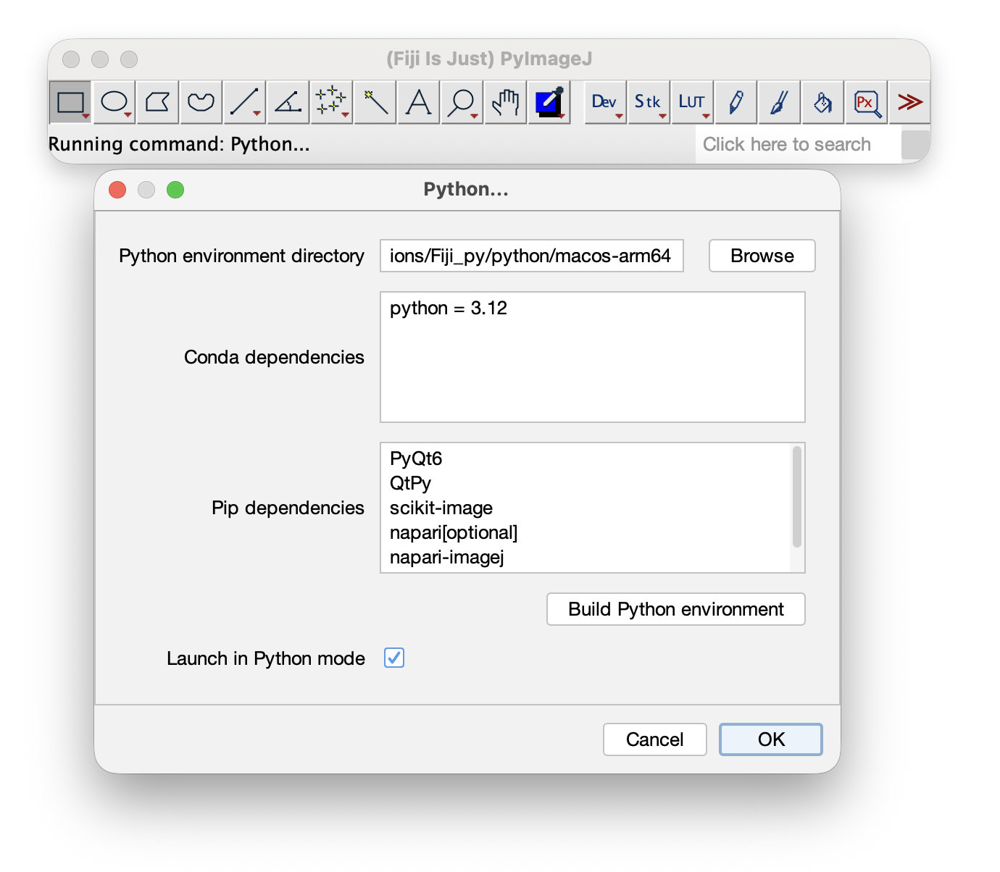

# Using PyImageJ from Fiji's Python mode

[Fiji](https://fiji.sc/) includes a Python mode that uses PyImageJ to run Python
scripts alongside Fiji. The configuration is available in the latest Fiji
release.

## Configure Python mode

1. Start Fiji and select **Edit > Options > Python...**.
2. Choose a **Python environment directory**. Use a directory dedicated to
   this Fiji installation.
3. Enter any required packages in the **Conda dependencies** and **Pip
   dependencies** fields, one package per line.
4. Click **Build Python environment** and wait for the build to finish.
5. Select **Launch in Python mode** and click **OK**.
6. Restart Fiji when prompted. Fiji will use the configured environment when
   it starts in Python mode.

The environment definition automatically includes the packages required to
connect Python to Fiji, including PyImageJ. The environment is built with
Conda and pip, so use the field that matches each dependency.

## Updating dependencies

The Python environment is built from the dependency lists in the dialog. If a
plugin or script needs a different dependency, update the lists and rebuild the
environment.

This integration manages one environment for a Fiji installation. It cannot
provide separate dependency environments for multiple plugins, so plugins that
require conflicting versions of the same package are not supported together.

Do not rebuild the environment currently being used by Python mode. Restart
Fiji in Java mode first, or choose a different target directory, then rebuild.